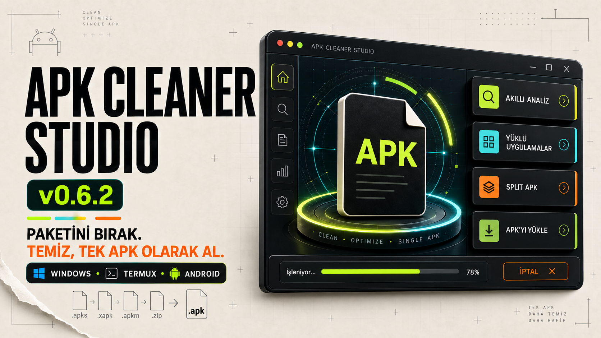

# APK Cleaner Studio v0.6.2

  

[Türkçe açıklama](README-TR.md) · [Termux installation](README-TERMUX.md) · [Build from source](BUILDING.md) · [v0.6.2 release notes](RELEASE-NOTES-v0.6.2.md)

A fully local Android, Windows and Termux tool for authorized APK ad cleanup and split-package conversion.

## Downloads

Download the current stable packages from [GitHub Releases](../../releases/latest):

| Platform | Package |
| --- | --- |
| Android | `APK-Cleaner-Studio-v0.6.2-Android.apk` |
| Windows | `APK-Cleaner-Studio-v0.6.2-Windows.exe` |
| Termux | `APK-Cleaner-Studio-v0.6.2-Termux.zip` |

Verify every download with `SHA256-v0.6.2.txt` from the same release.

## Features

- Detects 18 known mobile advertising SDK families.
- Applies conservative call-site patches in place on binary DEX instruction bytes without decompiling or rebuilding the DEX.
- Audits and patches the manifest in Balanced and Deep modes.
- Hides confirmed SDK ad views in decoded layout XML with `0dp` dimensions and `gone` visibility.
- Merges `.apks`, `.apkm`, and `.xapk` bundles into a signed standalone `.apk`.
- Supports conversion-only jobs or conversion with optional ad patches.
- Optionally strips DEX debug directives, applies standard APK ZIP alignment, and runs plain APKEditor `x` resource deobfuscation without `-fix-types` or manifest restoration.
- Automatically prepares a portable Java runtime and the local toolchain when missing.
- Includes light, system, and refined dark themes.

## Run

Android users install `APK-Cleaner-Studio-v0.6.2-Android.apk`. Windows users can double-click `APK-Cleaner-Studio-v0.6.2-Windows.exe`. Termux users extract `APK-Cleaner-Studio-v0.6.2-Termux.zip`, run `bash install-termux.sh` once, and use `bash start-termux.sh` afterwards.

Version 0.6.2 is the stable release focused on advisory split detection, independently selectable cleanup operations, smarter startup-message tracing, and a balanced desktop processing layout.

See [README-TR.md](README-TR.md) and [README-TERMUX.md](README-TERMUX.md) for full instructions.

The illustrated release overview is also available on [Telegraph](https://telegra.ph/APK-Cleaner-Studio-v062--Kararl%C4%B1-S%C3%BCr%C3%BCm-Notlar%C4%B1-09-20).

## Safety and limitations

Automated patching cannot guarantee compatibility for every APK. Modified APKs are re-signed and may not install over store builds. The tool does not bypass paid features, purchases, or license checks. Use it only with packages you own or are authorized to modify and test.
