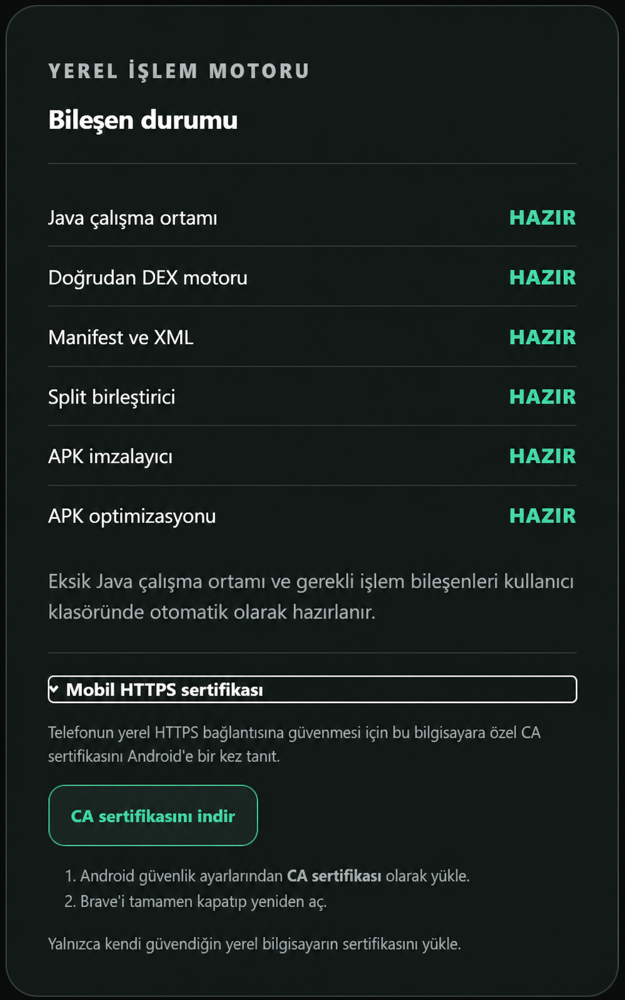
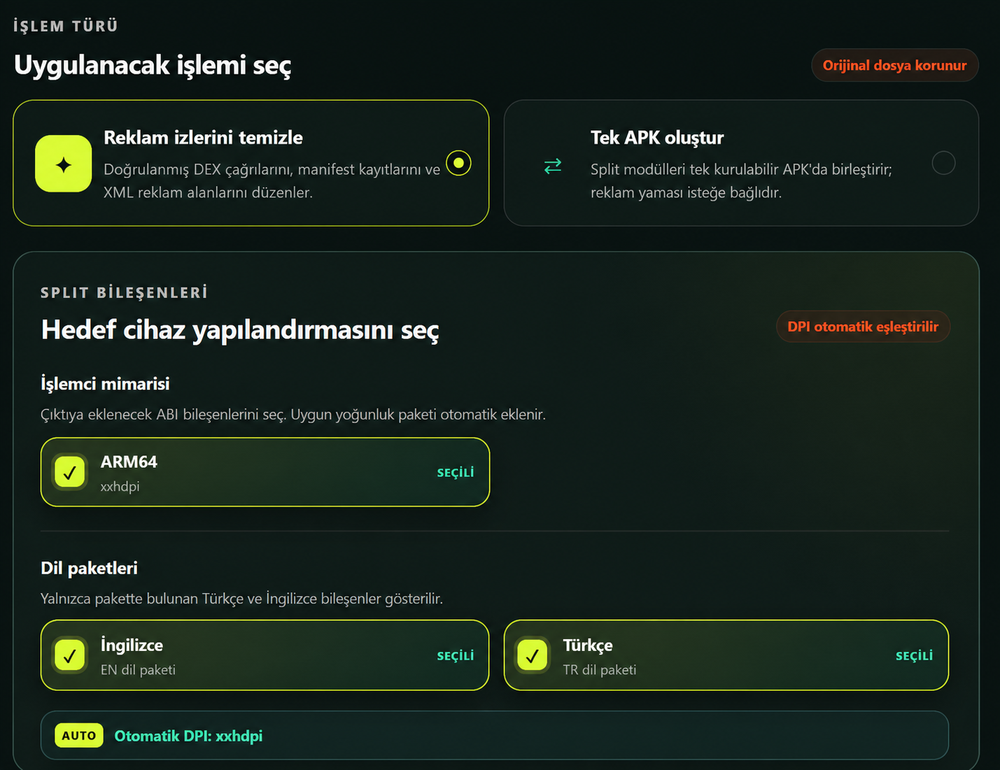
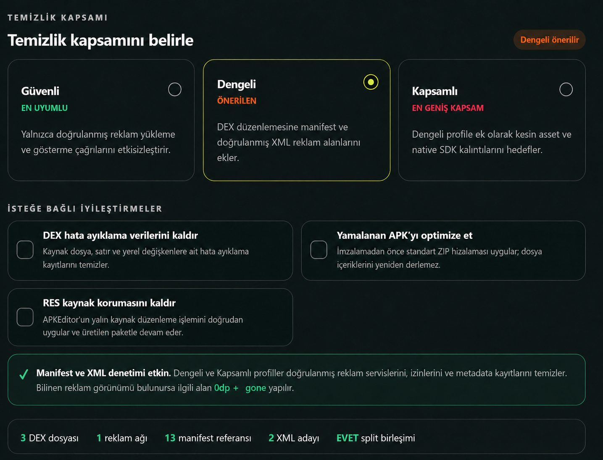
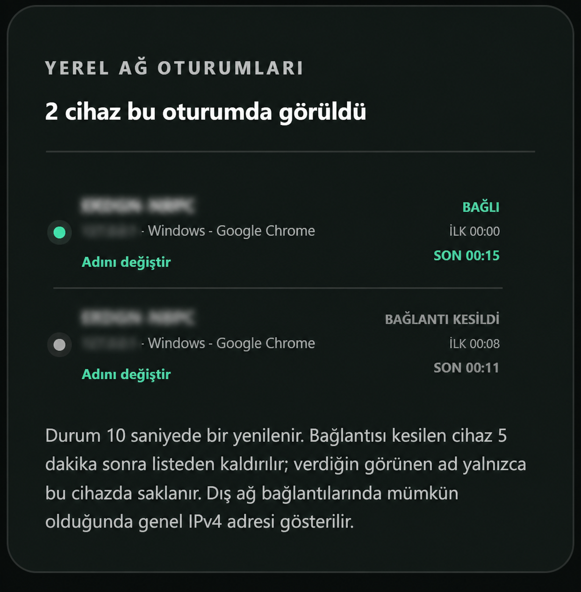
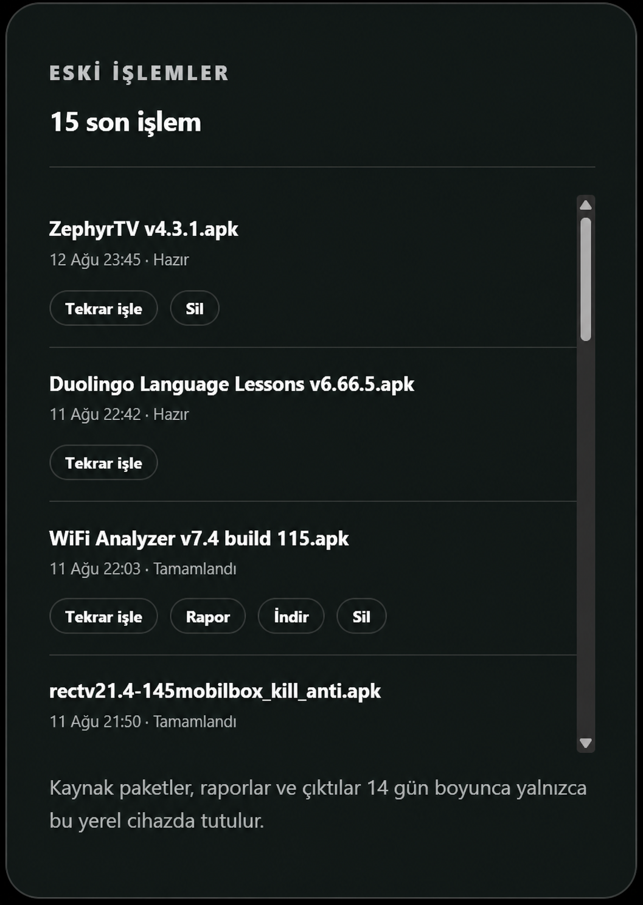

# APK Cleaner Studio v0.6.0–v0.6.1 — Kararlı Sürüm Notları

## APK Cleaner Studio v0.6.1 — Android sürümü ve bakım güncellemesi

**Motor 2.0 · 15 Ağustos 2026 · Windows, Termux ve Android**

v0.6.1, APK Cleaner Studio’yu ilk kez bağımsız bir Android uygulaması olarak sunarken Windows ve Termux paketlerinde de kullanılabilirlik, bağlantı yönetimi ve arayüz kararlılığına odaklanan bir bakım güncellemesidir. Üç platform aynı Motor 2.0 işleme altyapısını ve ortak arayüz dilini kullanır.

### ✨ Yeni özellikler

#### Android için bağımsız APK

APK Cleaner Studio artık Android’de Termux, komut satırı, haricî Java kurulumu veya ayrı bir tarayıcı gerektirmeden çalışır. Yerel işleme motoru, web arayüzü ve gerekli çalışma bileşenleri uygulama paketine gömülüdür.

- Paket adı: `com.apkrepo.apkcleanerstudio`
- Sürüm adı: `0.6.1`
- Android sürüm kodu: `61`
- Desteklenen mimariler: `arm64-v8a` ve `armeabi-v7a`
- Dil kaynakları: varsayılan dil ve Türkçe

#### Üç platformda ortak deneyim

Windows, Termux ve Android sürümleri aynı paket analizini, doğrudan DEX düzenleme akışını, split APK birleştirmeyi, manifest/XML denetimini ve raporlama sistemini kullanır. Ortak arayüz düzeltmeleri platform paketlerine birlikte aktarılır.

#### İşlemi güvenli biçimde iptal etme

Çalışan bir temizleme veya dönüştürme işi, sonuç beklenmeden arayüzdeki **İptal et** seçeneğiyle durdurulabilir. Yarım çıktı kullanıcıya tamamlanmış paket olarak sunulmaz.

#### Platforma duyarlı yerel HTTPS

Windows ve Termux sunucularında yerel CA sertifikası isteğe bağlı olarak kullanılabilir. Doğrulanmış HTTPS bağlantısında sertifika yönlendirmesi gizlenir; sertifika tanınmıyorsa HTTP erişimi korunur. Bağımsız Android uygulamasında haricî yerel sunucu bulunmadığından ana sertifika yönlendirmesi gösterilmez.

#### Android’e özgü uygulama deneyimi

Uygulama logosuyla uyumlu yerel açılış ekranı, Android durum çubuğuyla bütünleşen kenardan kenara yerleşim ve açık/koyu/sistem teması eklendi. Bağımsız uygulamada gereksiz olan **Yerel Ağ Oturumları** paneli gizlendi.

### 🛠 Hata düzeltmeleri ve iyileştirmeler

#### Android

- Android 16’da açılış sırasında oluşabilen `WindowInsetsController` kaynaklı çökme giderildi.
- Durum çubuğu ve uygulama başlığı arasındaki fazla boşluk düzeltildi.
- Uygulama başlığına dokunulduğunda temanın açık moda dönmesi önlendi; sistem teması düzeltildi.
- İşlenmiş APK’nın `download.bin` adıyla kaydedilmesi giderildi; gerçek APK dosya adı korunuyor.
- Açılış ekranı ve üst bar görsel bütünlüğü geliştirildi.
- Kullanılmayan kaynaklar ve hata ayıklama kalıntıları release paketinden ayıklandı.

#### Windows ve Termux

- Başlangıç bağlantısının sertifika durumuna uygun HTTP/HTTPS protokolüyle açılması düzeltildi.
- Termux kapandıktan sonra eski sunucu sürecinin 8080 numaralı bağlantı noktasını açık tutması önlendi.
- Termux başlangıç hata ekranı mobil terminal genişliğine uyarlandı; belgeler v0.6.1’e göre yenilendi.
- Dağıtım adlarında eski **Manager** ifadesi kaldırılarak **APK Cleaner Studio** adı standartlaştırıldı.

#### Ortak arayüz

- Cihaz modeli alınamadığında tarayıcıdan bağımsız **Android · cihaz adı alınamadı** açıklaması gösteriliyor.
- Sabit üst çubuk, tutarlı buzlu/sıvı cam görünümüyle yenilendi.
- Ana başlıktaki hareket animasyonu yeniden dengelendi.
- Açık temadaki düşük kontrastlı simge ve metinler iyileştirildi.
- İlk yüklemedeki geçici yerleşim bozulmaları ve kart sıçramaları azaltıldı.

### 🔐 Android paketleme ve doğrulama

- R8 küçültme ve kullanılmayan kaynak temizliği etkinleştirildi.
- DEX ve native hata ayıklama verileri temizlendi.
- APK Repo özel anahtarıyla **v2 + v3** imza kullanıldı.
- Standart ZIP hizalaması ve 16 KB native sayfa uyumluluğu doğrulandı.
- **96/96** otomatik test, Android Lint ve release derlemesi başarıyla tamamlandı.

### 📦 v0.6.1 dağıtım dosyaları

- `APK-Cleaner-Studio-v0.6.1-Windows.exe`
- `APK-Cleaner-Studio-v0.6.1-Termux.zip`
- `APK-Cleaner-Studio-v0.6.1-Android.apk`
- `SHA256-v0.6.1.txt`

**Önemli:** Düzenlenen APK’lar yeniden imzalanır. İmza uyuşmazlığı varsa yeni paket mevcut uygulamanın üzerine yüklenmeyebilir.

— Aşağıda v0.6.0’ın kapsamlı sürüm notları ve özellik görselleri korunmuştur.

## APK Cleaner Studio v0.6.0 — İlk Motor 2.0 kararlı sürümü

**Motor 2.0 · 12 Ağustos 2026 · Windows ve Termux**

APK Cleaner Studio’nun v0.6.0 kararlı sürümü yayınlanmaya hazır. Bu sürüm; doğrudan DEX düzenleme, seçilebilir split bileşenleri, geliştirilmiş reklam temizliği, yerel ağ yönetimi, işlem geçmişi ve yenilenen masaüstü/mobil deneyimi tek pakette bir araya getiriyor.

Önceki kararlı sürüm: **v0.5.3**

## ✨ Yeni özellikler

### Motor 2.0 — Doğrudan DEX düzenleme

APK içindeki hedef komutlar Smali metnine dönüştürülmeden doğrudan DEX üzerinde düzenleniyor. Yükleme sırasında hazırlanan güvenilir analiz işlem boyunca yeniden kullanılıyor; DEX dosyaları uygun donanımlarda kontrollü biçimde paralel işleniyor. Böylece özellikle büyük paketlerde analiz ve düzenleme süresi belirgin biçimde kısalıyor.

### Split paketler — Cihaza özel tek APK üretimi

APKS, APKM ve XAPK paketleri için ARMv7, ARM64, x86 ve x86_64 bileşenleri ayrı ayrı seçilebiliyor. Uygun DPI paketi mimariye göre otomatik eşleştiriliyor; pakette mevcutsa Türkçe ve İngilizce dil bileşenleri kullanıcı seçimine sunuluyor. Yalnızca seçilen bileşenlerle tek kurulabilir APK hazırlanıyor.

### Temizlik profilleri — Daha kontrollü reklam temizliği

**Güvenli**, **Dengeli** ve **Kapsamlı** profiller farklı uyumluluk düzeyleriyle sunuluyor. Motor; 18 doğrulanmış reklam ağı için DEX, manifest, XML, asset ve native kitaplık izlerini denetliyor. Kapsamlı profil dinamik `AdView`, native reklam ve banner kapsayıcılarını da hedefliyor; doğrulanmış reklam alanlarını `0dp + gone` ile gizleyebiliyor.

İsteğe bağlı olarak DEX hata ayıklama verileri temizlenebiliyor, çıktı ZIP hizalamasıyla optimize edilebiliyor ve RES kaynak koruması kaldırılabiliyor.

### Yerel ağ — Oturum ve cihaz yönetimi

Ana makine, yerel veya uzak istemcilerin bağlantı durumunu tek panelden izleyebiliyor. Algılanabilen cihaz, işletim sistemi ve tarayıcı bilgileri gösteriliyor; Android model kodları çevrimdışı katalogla anlaşılır cihaz adlarına dönüştürülüyor. Brave, Microsoft Edge, Opera, Samsung Internet, Firefox, Google Chrome ve Safari ayrı ayrı tanınabiliyor.

Ana makine bir istemciyi engelleyebiliyor, engeli kaldırabiliyor veya oturum kaydını silebiliyor. Engellenen istemci arayüze erişemiyor ve yöneticiden yeniden erişim isteyebiliyor.

### İş geçmişi — Rapor, indirme ve yeniden işleme

Son 14 günün yerel işleri arayüzde saklanıyor. Tamamlanan bir iş yeniden açılabiliyor; işlem raporu görüntülenebiliyor, çıktı indirilebiliyor veya kayıt kullanıcı tarafından silinebiliyor. Kaynak paketler ve raporlar uzak bir sunucuya gönderilmiyor.

### Yerel HTTPS — İsteğe bağlı güvenilir bağlantı

HTTP ve HTTPS aynı yerel bağlantı noktasında birlikte çalışabiliyor. Kullanıcı yerel CA sertifikasını cihazına güvenilir olarak kurarsa bağlantı sessizce HTTPS’e yükseltilebiliyor. Sertifika veya tarayıcı politikası uygun değilse yerel HTTP erişimi kullanılmaya devam ediyor. CA özel anahtarı cihaz dışına çıkarılmıyor ve dağıtım paketlerine eklenmiyor.

### Arayüz — Masaüstü ve mobil deneyim

Mobil sabit başlık, duyarlı tek/çok sütunlu yerleşim, açık/koyu/sistem teması, daha belirgin seçim kartları ve yumuşak geçişler eklendi. Türkçe metinler, tipografi ölçekleri, footer alanı ve konsol renk hiyerarşisi baştan sona gözden geçirildi.

### Sonuç ekranı — Raporlu ve izlenebilir çıktı

İlerleme yüzdesi gerçek işlem aşamalarıyla eşleştirildi ve sonuç dosyası yazılmadan `%100` gösterilmemesi sağlandı. Tamamlanan işlem; DEX, manifest, XML ve hata ayıklama sonuçlarını özetliyor; çıktı APK’sına ve ayrıntılı rapora doğrudan erişim sunuyor.

## 🛠 Hata düzeltmeleri

- **Motor:** Yükleme ve işlem başlangıcında aynı paketin gereksiz yere ikinci kez taranmasına yol açan tekrar kaldırıldı.
- **Motor:** Doğrudan DEX motorunun geçerli sonuç ürettiği hâlde hata gösterebildiği durumlar düzeltildi.
- **Motor:** Uzak bağlantıda ilerleme `%100` seviyesine ulaştıktan sonra işlem aşamalarının yeniden başlamasına neden olan durum giderildi.
- **Motor:** Paralel DEX işlemlerinde sonuçların kararlı ve sıralı toplanması sağlandı.
- **XML / Manifest:** Doğrulanmış reklam alanlarının ilk işlemde atlanabildiği durum düzeltildi; ilk geçişte `0dp + gone` uygulanması güvenceye alındı.
- **RES:** Kaynak adlarının sayısal kimliklere dönüşmesine yol açan akış düzeltildi; özgün `public.xml` ad–kimlik eşlemesi korunuyor.
- **Split paket:** Tek APK oluştururken reklam yaması seçildiğinde temizlik profilinin pasif kalması düzeltildi.
- **Split paket:** Mimari, dil ve DPI seçimlerinin çıktı bileşenleriyle eşleşmesi doğrulandı.
- **İlerleme:** Yüzde değerinin büyük aralıklarla sıçraması yumuşatıldı; tamamlanma durumu çıktı ve rapor hazır olduktan sonra gösteriliyor.
- **Ağ:** Reverse proxy arkasındaki bağlantılarda mümkün olduğunda gerçek genel IPv4 adresinin kullanılması sağlandı.
- **Ağ:** Bağlantısı kesilen istemcilerin listede süresiz kalması önlendi; kayıtlar beş dakika sonra otomatik kaldırılıyor.
- **Ağ:** Engellenen istemcinin ana arayüzü görüntülemeye devam edebilmesi engellendi.
- **Ağ:** Uzun cihaz adlarının dar ekranlarda taşması düzeltildi; adlar gerektiğinde ikinci satıra kayıyor.
- **Arayüz:** Koyu temada seçili kutuların belirsiz görünmesi, mobil başlığın kaybolması ve footer kartlarının asimetrisi giderildi.
- **Arayüz:** Mobil hero metnindeki üst üste binme, masaüstü adım göstergelerindeki tırtıklı kenarlar ve gereksiz boşluklar düzeltildi.
- **Windows:** Pencere kapatıldıktan sonra sunucu veya yardımcı süreçlerin Görev Yöneticisi’nde kalabildiği durum giderildi.
- **Veri:** JSON durum kayıtları atomik ve kilitli yazılıyor; eşzamanlı güncellemelerde veri yarışları önlendi.
- **Paketleme:** Çalışma geçmişi, istemci durumu, geçici dosyalar ve TLS özel anahtarlarının dağıtım paketlerine sızması engellendi.

## ⚙️ Teknik notlar

- Uygulama sürümü: **v0.6.0 Kararlı**
- Yerel motor: **2.0**
- Varsayılan erişim: **127.0.0.1:8080**
- Desteklenen paketler: **APK, APKS, APKM, XAPK**
- Platformlar: **Windows ve Termux**
- İşlem modeli: **%100 yerel**

Yamalanan APK yeniden imzalanır. Bu nedenle kaynak uygulamanın özgün imzasıyla kurulmuş sürümünün üzerine doğrudan kurulamayabilir.

## ✅ Doğrulama özeti

- **76/76** Python motor, veri, güvenlik, güncelleme ve bütünlük testi başarılı.
- **2/2** web arayüzü sözleşme testi başarılı.
- ESLint, üretim web derlemesi ve Java Direct DEX derlemesi başarılı.
- Gerçek APK ve APKS örneklerinde yama, split birleştirme, RES düzenleme, ZIP hizalama, imzalama, rapor ve indirme akışları doğrulandı.
- Aynı portta **200 HTTP + 200 HTTPS** isteği, 40 eşzamanlı istemciyle hatasız tamamlandı.
- Windows uygulaması kapatıldıktan sonra çalışan alt süreç veya dinlenen bağlantı noktası kalmadığı doğrulandı.

## 📦 Dağıtım dosyaları

- `APK-Cleaner-Manager-v0.6.0-Windows.exe`
- `APK-Cleaner-Manager-v0.6.0-Termux.zip`
- `SHA256-v0.6.0.txt`

— **APK Repo Grubu**
