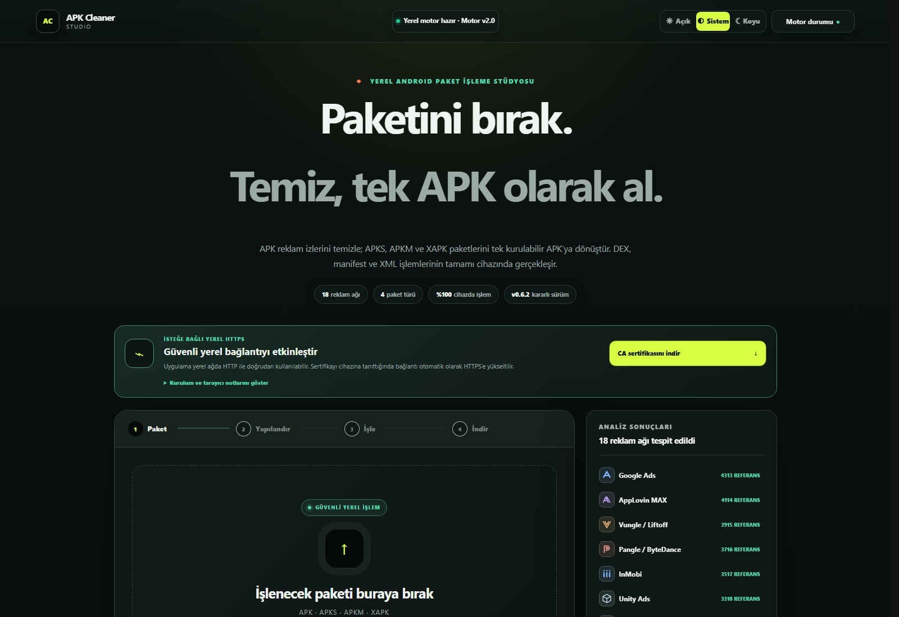
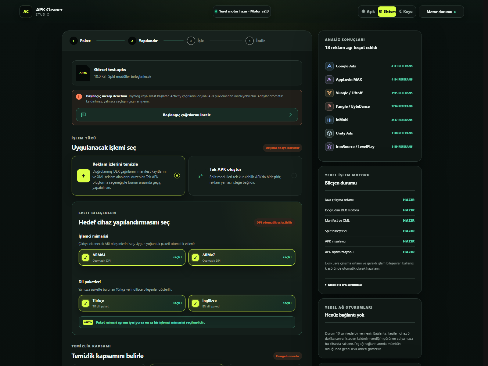
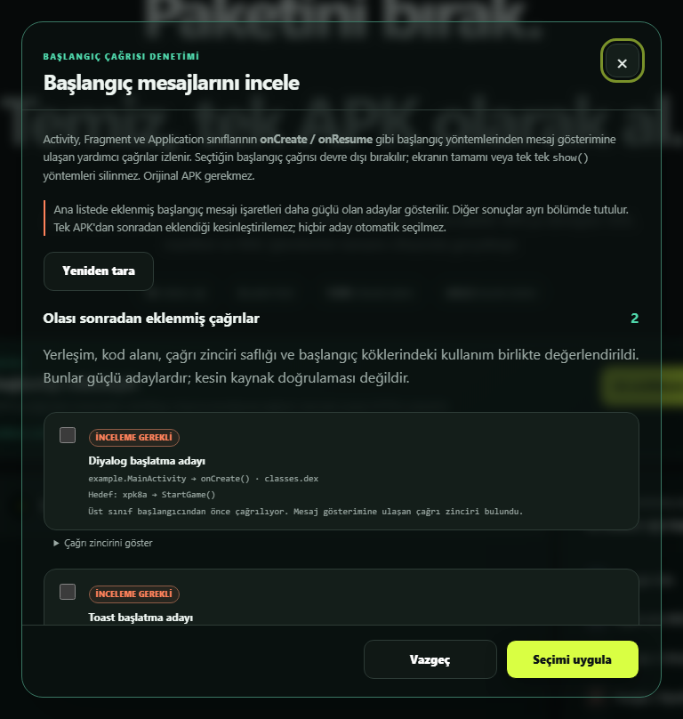
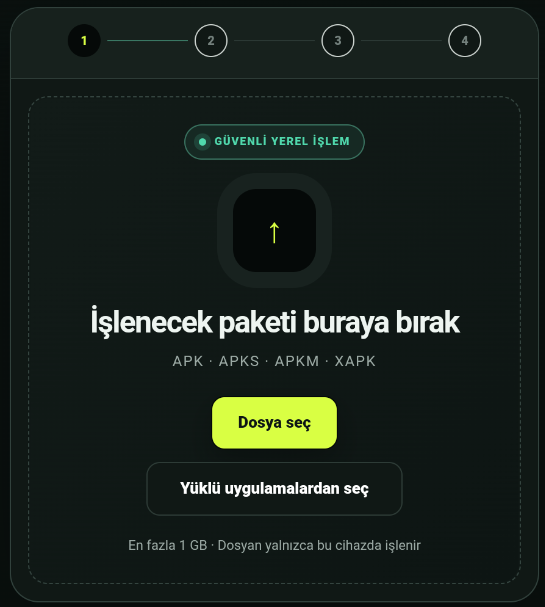
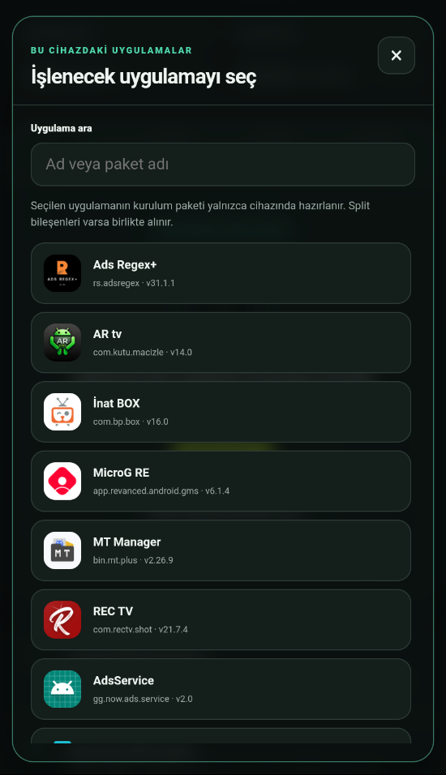
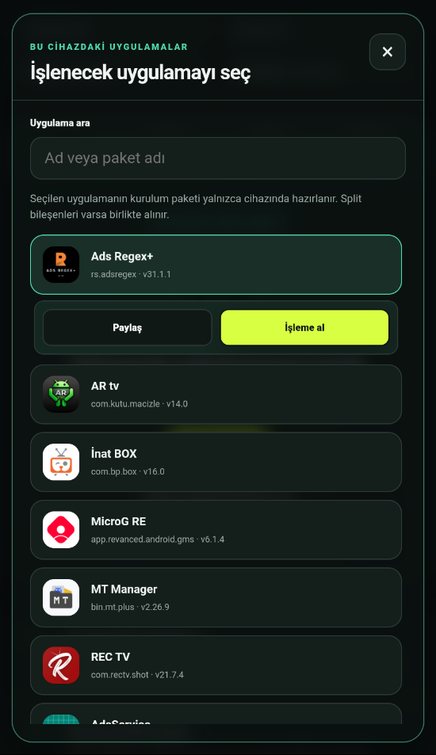
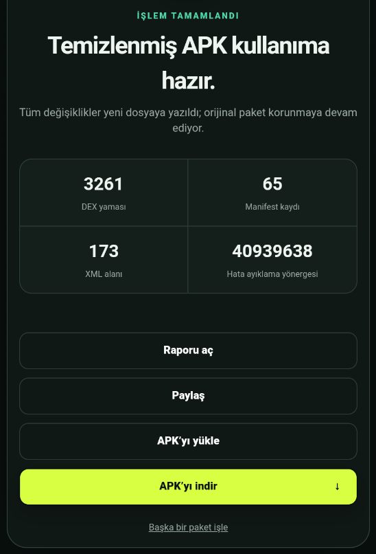
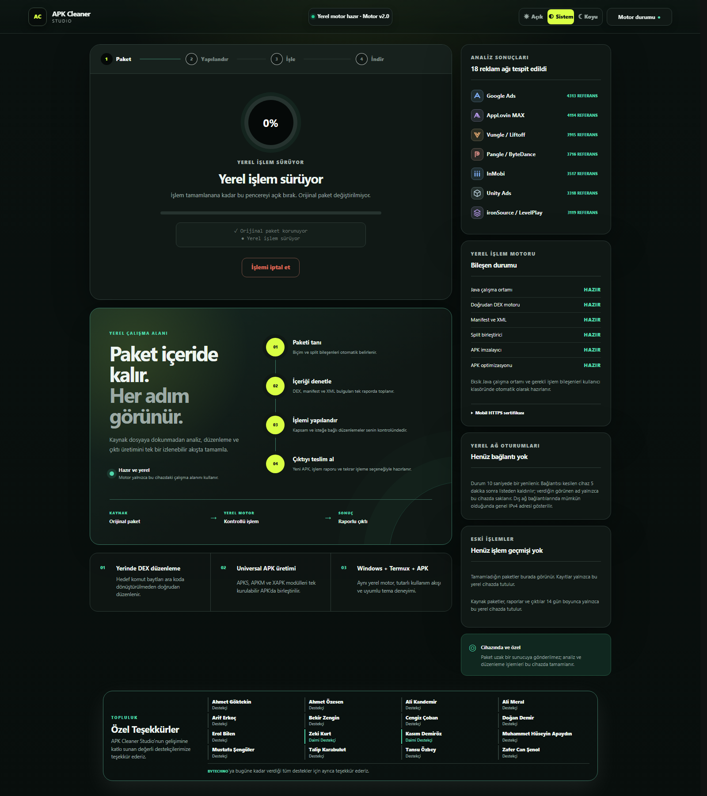

# APK Cleaner Studio v0.6.2 — Kararlı Sürüm Notları

## APK Cleaner Studio v0.6.2 — Akıllı analiz ve arayüz güncellemesi

**Motor 2.0 · 19 Eylül 2026 · Android, Windows ve Termux**

APK Cleaner Studio v0.6.2 kapsamlı bir kararlı sürümdür. Bu güncelleme reklam temizleme akışını kullanıcı kontrolüne bırakır, başlangıç mesajlarını daha isabetli biçimde inceler ve Android’de yüklü uygulamalardan paket almayı kolaylaştırır. Ayrıca üç platformdaki arayüzü daha düzenli ve tutarlı hâle getirir.

Önceki kararlı sürüm: **v0.6.1**

### ✨ Yeni özellikler

### Reklam temizleme artık isteğe bağlı

Tek APK işlenirken **Reklam izlerini temizle** seçeneği kapatılabilir. Reklam temizleme kapalıysa Güvenli, Dengeli ve Gelişmiş kapsam seçenekleri de devre dışı kalır. Böylece kullanıcının seçmediği bir işlem yanlışlıkla uygulanmaz.

APKS, APKM ve XAPK paketlerinde **Tek APK oluştur** seçeneği de sunulur. Bu seçenek bulunsa bile reklam temizleme kartı görünür kalır. Kullanıcı iki işlem arasında güvenli biçimde geçiş yapabilir.

### Başlangıç mesajları artık daha akıllı inceleniyor

Uygulama açılışında gösterilen diyalog, Toast, Snackbar, DialogFragment, PopupWindow ve Compose mesajları artık yalnızca çağrı adına göre değerlendirilmez. Tarama sırasında Activity, Fragment ve Application yaşam döngülerinin yanı sıra pencere odağı ve diğer başlangıç yolları da izlenir. Çağrının bulunduğu ekran, başlangıç akışı ve kullanım bağlamı birlikte değerlendirilerek güçlü adaylar öne çıkarılır.

Belirsiz veya uygulamanın kendi akışına benzeyen adaylar ayrı inceleme bölümlerinde tutulur. Hiçbir aday otomatik olarak kaldırılmaz. Kullanıcı sonuçları gözden geçirir ve yalnızca seçtiği başlangıç çağrılarını etkisizleştirir. Böylece uygulamanın ortak mesaj gösterme yöntemi veya ekran akışı yanlışlıkla bozulmaz.

### Android’de yüklü uygulamalardan paket alma

Android sürümünde her uygulamanın simgesi, uygulama adı, paket adı ve sürüm numarası listede gösterilir. Arama alanı sayesinde istenen uygulamaya hızlıca ulaşılabilir. Seçilen uygulamanın split bileşenleri varsa bunlar da pakete eklenir.

Bir uygulama seçildiğinde kaynak paket doğrudan işleme alınabilir veya Android’in paylaşım menüsüyle dışarı aktarılabilir. Hazırlanan dosyanın adında uygulama adı ve sürüm numarası birlikte yer alır.

### Android sonuç ekranından yükleme, indirme ve paylaşma

İşlenmiş paket Android sonuç ekranından indirilebilir, paylaşılabilir veya doğrudan sistem paket yükleyicisine gönderilebilir. Bu işlemler **APK’yı indir**, **Paylaş** ve **APK’yı yükle** seçenekleriyle yapılır. İndirme tamamlandığında doğru dosya adıyla **Çıktı kaydedildi** bildirimi gösterilir. **APK’yı yükle** seçeneği kurulumdan önce paketin cihaz mimarisi ve Android sürümüyle uyumluluğunu, cihazdaki mevcut kurulumun durumunu ve olası imza çakışmalarını denetler.

Cihazda farklı imzalı ya da daha yeni bir sürüm yüklüyse olası veri kaybı açıkça bildirilir. Kaldırma işlemi yalnızca kullanıcı onayıyla başlar. Bilinmeyen uygulama yükleme izni ekranından veya kaldırma ekranından uygulamaya dönüldüğünde bekleyen kurulum güvenli biçimde devam eder.

### Uygulama içi rapor ve modern onay pencereleri

Sonuç ve geçmiş işlem raporları uygulama içinde açılabilir. Raporları görüntülemek için önce indirmek gerekmez. Rapor istenirse ayrıca metin dosyası olarak kaydedilebilir. Tarayıcının eski onay ve metin giriş kutuları yerine açık, koyu ve sistem temalarıyla uyumlu uygulama pencereleri kullanılır.

### İşlem boyunca korunan masaüstü çalışma alanı

İşlem seçimi, çalışma ve sonuç aşamalarında sağ sütundaki analiz, motor, yerel ağ ve geçmiş kartları görünür kalır. Ana ekrandaki **Paket içeride kalır, her adım görünür** kartı ve altındaki yetenek şeridi de işlem sırasında kaybolmaz.

Çok sayıda reklam ağı veya eski işlem bulunduğunda kartlar sayfayı gereksiz yere uzatmaz. Bir kartın içeriği belirlenen yüksekliği aşarsa kartın içinde kaydırılabilir bir alan kullanılır. Bu alan bütün kartlarda aynı görünüme sahiptir.

### Daha dengeli ve tutarlı arayüz

Açık, koyu ve sistem temaları yeniden dengelenerek kart yüzeyleri, yerel HTTPS alanı, üst çubuk kontrolleri ve yazı tipleri birbiriyle uyumlu hâle getirildi. Farklı ekran genişliklerinde tema ve motor durumu kutularının orantılı kalması sağlandı.

Kaydırma çubukları analiz ve geçmiş kartlarında aynı görünüme kavuştu. Kaydırma sona erdiğinde çubuk aniden kaybolmaz, yumuşak bir geçişle gizlenir.

### 🛠 Hata düzeltmeleri ve iyileştirmeler

### Motor ve paket işleme

- Reklam izleri temizlenirken gereksiz yere uzun NOP dizileri oluşturulmasına yol açan durum giderildi.
- Bir hedef çağrı kaldırılırken gerekenden daha geniş bir kod alanının değiştirilmesi önlendi. Düzenleme yalnızca gerekli komut aralığıyla sınırlandı.
- Reklam temizleme kapatıldığında temizlik kapsamı seçenekleri de devre dışı bırakıldı.
- Split paketlerde **Tek APK oluştur** seçeneğinin bulunduğu ekranlarda reklam temizleme kartının yanlışlıkla kaybolması engellendi.
- Manifestte kalan Play split metadata’sı artık tek başına kesin kurulum hatası olarak değerlendirilmez. Yalnızca gerçek bir risk bulunduğunda açıklayıcı uyarı gösterilir.
- Split kurulumlarda tek başına kullanılamayan `base.apk` bileşeninin bağımsız paket olarak işlenmesi engellendi. Bu durumda kullanıcıdan özgün APKS, APKM veya XAPK paketi istenir.
- Reklam ağı bulunmasa bile seçilen bağımsız işlemlerin çalışması sağlandı. Bu işlemler arasında DEX düzenleme, kaynak düzenleme, DEX yapısını yeniden düzenleme ve APK optimizasyonu da yer alır.
- Kaynak korumasını kaldırma işlemi ile XML reklam alanı denetimi doğru sırada çalışacak biçimde düzenlendi. Kaynaklar çözüldükten sonra XML alanları incelenir.
- Google reklam çağrılarında ve kodla oluşturulan banner alanlarında güvenle uygulanabilen temizleme kapsamı genişletildi.
- Play Store’dan alınan paketlerde kaynak ve bütünlük denetimleri nedeniyle kurulum veya çalıştırma sorunu yaşanabileceği analiz aşamasında belirtilir. Uygulamanın doğrulama mekanizması değiştirilmeden kullanıcı bilgilendirilir.
- Birden fazla DEX içeren büyük paketlerde tüm yöntemler bir kerede belleğe yüklenmez. Bunun yerine yalnızca gerektiğinde doldurulan ve boyutu sınırlı olan bir önbellek kullanılır.
- Eski bir pakete veya önceki taramaya ait başlangıç mesajı seçimlerinin yeni işleme aktarılması engellendi. Seçilen hedef, yama uygulanmadan hemen önce yeniden doğrulanır.
- Geçmişte tamamlanmış bir işlem yeniden başlatıldığında eski iş durumu kullanılmaz. Özgün kaynak paketin yeni ve yazılabilir bir kopyası kullanılarak ayrı bir işlem oluşturulur.

### Android

- Yüklü uygulama listesinde simgelerin karışması veya uzun listelerde kaydırmanın takılması giderildi.
- Seçilen uygulamanın sürüm numarası kaynak paketinin dosya adına eklendi.
- Uygulama listesindeki **Paylaş** ve **İşleme al** seçeneklerinin yanlış uygulamayı hedeflemesi engellendi.
- Açık ve koyu temadaki kart yüzeyleri ile dokunmatik alanlar yeniden dengelendi.
- Yüklü uygulama listesinin gecikmeden açılması sağlandı. Gerçek uygulama simgeleri ve split bileşenleri arka planda hazırlanırken arayüz kullanılmaya devam edilebilir.
- Uygulama listesi yenilenirken mevcut satırlar ve simgeler korunur. Böylece simgelerin yeniden yüklenip yanıp sönmesi engellenir.
- Başlatıcı ekranında kullanılan gerçek uygulama simgesine öncelik verilir. Uyarlanabilir simgeler, içerikleri kesilmeden doğru ölçüde gösterilir. Arama klavyesi yalnızca kullanıcı arama alanına dokunduğunda açılır.
- Tek APK doğrudan paylaşılabilir. Split uygulamalar ise hiçbir bileşeni eksiltilmeden APKS olarak hazırlanır. Paylaşılan dosyanın adına uygulama sürümü de eklenir.
- Dikey ve yatay görünümlerdeki taşmalar giderildi. Durum çubuğu, ekran çentiği ve uygulama içi pencereler güvenli ekran alanı içinde tutulur.
- Android `WebView` beklenmedik biçimde kapanırsa uygulama kapanmaz. Kullanıcıya yeniden açma ekranı gösterilir.
- VPN veya sistemde tanımlı vekil sunucu nedeniyle yerel motor bağlantısının içeriği boş bir hata mesajıyla sonuçlanması engellendi. Uygulama içi motor bağlantısı doğrudan cihazdaki yerel oturuma ulaşacak biçimde düzenlendi.
- Kurulum, paylaşım veya sistem izinleri ekranlarından biri açılamadığında işlem kontrollü biçimde sonlandırılır. Tamamlanmamış indirmeler ve geçici bağlantılar temizlenir.
- Bazı Android üreticilerinde çıktı imzalamayı engelleyen uyumluluk sorunu giderildi.
- Arka plandaki `WebView` ile boşta kalan yardımcı işlemler daha erken duraklatılır. Bellek baskısı oluştuğunda yeniden oluşturulabilen simge önbelleği temizlenir. Kullanıcı dosyaları ve bekleyen kurulum bilgileri korunur.

### Windows ve Termux

- Windows’ta uygulama ilk açıldığında aynı bilgisayarın yerel ağ oturumları listesinde iki kez görünmesi sorunu giderildi. HTTP ve HTTPS bağlantıları artık tek bir cihaz kaydında birleştirilir.
- Yerel ağ erişimi korunurken cihaz adı, bağlantı durumu ve son görülme bilgileri daha tutarlı hâle getirildi.
- Android, Windows ve Termux paketlerinin aynı arayüzü ve Motor 2.0 kaynaklarını kullanması sağlandı.
- İstemcinin indirmeyi yarıda kesmesi veya bağlantıyı kapatması normal bir durum olarak ele alınır. Bu durumda kullanıcıya gereksiz bir sunucu hatası gösterilmez.

### Ortak arayüz

- Sağ sütunda içeriği taşan kartların birbirinden çok farklı yüksekliklere ulaşması önlendi. Kartların varsayılan küçük görünümleri korundu ve yalnızca taşan içerik sınırlandı.
- İşlem ve sonuç ekranlarında durum kartlarının, çalışma alanı tanıtım kartının ve alt yetenek şeridinin kaybolması sorunu giderildi.
- İlerleme halkasının hareketi ve açılır pencere geçişleri yumuşatıldı. Kaydırma çubuğunun gizlenme animasyonu da daha akıcı hâle getirildi.
- Açık temadaki yerel HTTPS simge kutusu, koyu temayla aynı görsel ağırlığa getirildi.
- Üst çubuktaki tema, test kanalı ve motor durumu kutuları farklı masaüstü genişliklerinde daha simetrik hâle getirildi.
- Destekçiler alanındaki uyumsuz yazı tipi ve hizalama sorunları giderildi.
- İşlem başladığında ilerleme kartının, tamamlandığında ise sonuç kartının otomatik olarak görünür alana gelmesi sağlandı.
- Rapor, onay, başlangıç mesajı inceleme ve uygulama listesi için kullanılan pencereler ortak açılış ve kapanış geçişlerine kavuştu. Bir pencere kapanana kadar arka plandaki sayfayla yanlışlıkla etkileşime girilmesi engellendi.
- Kaydırma çubuğunun görünüp kaybolması nedeniyle oluşan yatay kayma giderildi. Profil kartlarındaki kenarlık sıçramaları ve butonların ağır hissettiren basma animasyonları da düzeltildi.
- İlerleme halkasının özgün nefes animasyonu geri getirildi. Animasyon farklı yenileme hızlarında aynı sürede tamamlanır ve işletim sistemindeki azaltılmış hareket tercihine uyar.
- Arayüz arka plana geçtiğinde gereksiz durum sorguları ve dekoratif hareketler duraklatılır. Devam eden paket işlemleri ve dosya aktarımları kesilmez.
- Özel Teşekkürler alanı daha kompakt ve ekran genişliğine uyum sağlayan bir düzene geçirildi. Daimi destekçiler görsel olarak ayrıldı.
- Analiz sonuçlarındaki tek harfli işaretler, 18 reklam ağının her biri için hazırlanmış, temayla uyumlu ve uygulamaya gömülü rozetlerle değiştirildi.
- Açılır pencerelerin yüzeyleri ve dokunma geri bildirimleri hafifletildi. Açık temadaki arka plan perdesi ile kartlar, koyu temadaki görsel hiyerarşiye uyumlu hâle getirildi.

### 🔐 Paketleme ve yerel kullanım

- Paket analizi, düzenleme ve çıktı üretimi cihaz üzerinde tamamlanır. Kaynak paket hiçbir aşamada uzak bir sunucuya gönderilmez.
- Android, Windows ve Termux dağıtım paketlerinde geçici çalışma verileri veya özel anahtar kalıntıları bulunmaz.
- Android paketi, v0.6.1 sürümünün üzerine yüklenebilecek biçimde hazırlanmıştır.
- Android çıktısı oluşturulduktan sonra dosyanın eksiksiz oluşturulduğu, APK imzasının geçerli olduğu ve ZIP hizalamasının doğru yapıldığı denetlenir. Eksik veya kurulamayacak bir çıktı kullanıcıya başarılı olarak gösterilmez.
- Android çıktıları v2 ve v3 imza şemalarıyla imzalanır ve 16 KB uyumlu ZIP hizalamasıyla hazırlanır.
- Üç platformda oluşturulan APK’lar ortak **APK Cleaner Studio** imza kimliğiyle hazırlanır.

### 📦 v0.6.2 dağıtım dosyaları

- `APK-Cleaner-Studio-v0.6.2-Android.apk`
- `APK-Cleaner-Studio-v0.6.2-Windows.exe`
- `APK-Cleaner-Studio-v0.6.2-Termux.zip`
- `SHA256-v0.6.2.txt`

Android paketi `com.apkrepo.apkcleanerstudio` paket kimliğini ve `62` sürüm kodunu kullanır. Bu paket v0.6.1 kurulumunun üzerine yüklenebilir. Üç platform aynı Motor 2.0 işleme mantığını ve ortak arayüzü kullanır.

**Önemli:** Düzenlenen APK’lar yeniden imzalanır. İmza uyuşmazlığı varsa yeni paket mevcut uygulamanın üzerine doğrudan yüklenmeyebilir.

— APK Repo Grubu
